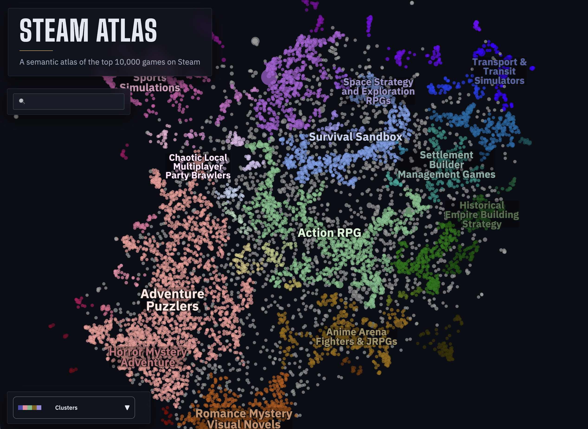

# Steam Atlas

**[View the live map](https://stevenfazzio.github.io/steam-atlas/)**

<p align="center">
  <a href="https://stevenfazzio.github.io/steam-atlas/">
    
  </a>
</p>

A semantic map of the top 10,000 most-reviewed games on Steam, positioned by similarity of their store descriptions and community tags. Pan, zoom, and search; hover for the capsule image and summary; click any point to open the game on Steam.

## Pipeline

Ten standalone stages run in order. End-to-end takes about four hours; the SteamSpy crawl in stage 01 dominates.

```bash
make install                                         # uv sync --extra dev

uv run python pipeline/00_enumerate_games.py         # FronkonGames HF dataset → candidates.parquet
uv run python pipeline/01_fetch_tags.py              # SteamSpy tag votes (~3.3 hr) → games.parquet
uv run python pipeline/02_select_top_games.py        # Trim to top 10,000 by review volume
uv run python pipeline/03_compute_sentiment.py       # Steam-style label from positive/negative counts
uv run python pipeline/04_summarize_descriptions.py  # Claude Haiku tagline + summary (~$5-10)
uv run python pipeline/05_embed_descriptions.py      # Cohere embed-v4.0 (512-dim)
uv run python pipeline/06_reduce_umap.py             # UMAP cosine, 512D to 2D
uv run python pipeline/07_label_facets.py            # Per-game facet labels via Haiku (~$5-10)
uv run python pipeline/08_label_topics.py            # Toponymy region labels via Claude Sonnet
uv run python pipeline/09_visualize.py               # DataMapPlot HTML → docs/index.html
```

Or just `make pipeline`.

### Two-source fetch

Stage 00 reads the [FronkonGames Steam Games Dataset](https://huggingface.co/datasets/FronkonGames/steam-games-dataset) on Hugging Face, a curated mirror of the full Steam catalog with prices, capsule URLs, descriptions, and review counts. Stage 01 supplements each candidate with community tag votes from [SteamSpy](https://steamspy.com/api.php), which FronkonGames doesn't include.

### Facet schema is out-of-band

`pipeline/design_facets.py` runs separately (via `make design-facets`, not part of `make pipeline`). It clusters the embeddings, asks Claude Opus to propose a small set of orthogonal facets, and writes `pipeline/facets_schema.json`, which is committed. Stage 07 labels each game against that schema. Re-run the design step only when intentionally changing the facets themselves.

### Data flow

Outputs land in `data/` (gitignored):

```
candidates.parquet → games.parquet ─┬→ embeddings.npz → umap_coords.npz → labels.parquet
                                    │                                          │
                                    ├→ facets.parquet                          │
                                    │                                          │
                                    └──────────────────────────────────────────┴→ steam_atlas.html
```

## Environment variables

Set in `.env` (loaded automatically):

| Variable | Used by | Purpose |
|---|---|---|
| `ANTHROPIC_API_KEY` | stages 04, 07, 08, `design_facets` | Claude summaries, facet labels, region naming |
| `CO_API_KEY` | stages 05, 08, `design_facets` | Cohere embeddings |

Stages 00, 01, 02, 03, 06, 09 require no auth (Hugging Face and SteamSpy are public).

## What you can do on the map

- Pan, zoom, and search by game name
- Hover for the capsule image, tagline, summary, review sentiment, and top tags
- Click any point to open it on Steam
- Switch colormaps: clusters, primary genre, sentiment, free-to-play, review count, plus one per discovered facet
- Read region labels at the level of detail your zoom warrants

## Technical details

| Component | Choice |
|---|---|
| Game enumeration | [FronkonGames Steam Games Dataset](https://huggingface.co/datasets/FronkonGames/steam-games-dataset) |
| Community tags | [SteamSpy](https://steamspy.com/api.php) |
| Embeddings | Cohere `embed-v4.0` (512-dim) |
| Dimensionality reduction | UMAP (cosine, n_neighbors=15, min_dist=0.05) |
| Region clustering | [Toponymy](https://github.com/TutteInstitute/Toponymy) |
| Region naming | Claude Sonnet |
| Description summarization | Claude Haiku |
| Facet schema design | Claude Opus + [EVoC](https://github.com/TutteInstitute/EVoC) clustering (one-shot) |
| Facet labeling | Claude Haiku (per-game) |
| Visualization | [DataMapPlot](https://github.com/TutteInstitute/DataMapPlot) |

## Development

```bash
make install        # uv sync --extra dev
make lint           # ruff check + format check
make format         # ruff format
make test           # pytest
make pipeline       # run all stages
make design-facets  # one-shot schema rebuild (rare)
```

Python ≥ 3.11. Full dependency list in [`pyproject.toml`](pyproject.toml).

## Sibling projects

Same skeleton, same rendering stack, different corpus:

- [`semantic-github-map`](https://github.com/stevenfazzio/semantic-github-map): top GitHub repos by stars
- [`huggingface-dataset-map`](https://github.com/stevenfazzio/huggingface-dataset-map): public datasets on Hugging Face
- [`oeisdata-map`](https://github.com/stevenfazzio/oeisdata-map): integer sequences from the OEIS
